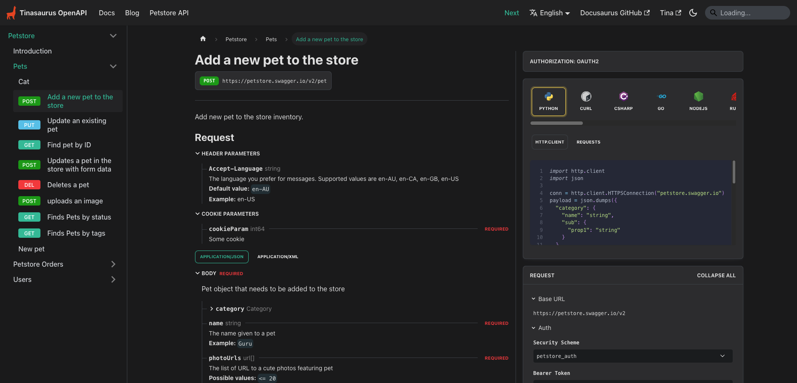

# tinasaurus-openapi

An example [Docusaurus 3](https://docusaurus.io/) documentation site with [TinaCMS](https://tina.io/), [OpenAPI](https://swagger.io/specification/), [Mermaid](https://mermaid.js.org/) charts and [Lunr](https://lunrjs.com/) search integration.

The project was created by creating a new Docusaurus v3 site with Palo Alto Networks' [OpenAPI plugin](https://github.com/PaloAltoNetworks/docusaurus-openapi-docs) and merging [Tinasaurus](https://github.com/tinacms/tinasaurus) to create a working config.

**Note**: Lunr search is available only in production.



## Quickstart With Tina

```
$ npm install && npm run dev
```

Or

```
$ yarn && yarn dev
```

This will install dependencies and open the website in your browser.

Visit the CMS at [http://localhost:3000/admin](http://localhost:3000/admin) to start editing.

## About

[Watch an overview of Tinasaurus on YouTube](https://www.youtube.com/watch?v=2bHBwM54UB8).

### Installation

```
$ npm install
```

Or

```
$ yarn
```

### Local Development

```
$ npm run dev
```

Or

```
$ yarn dev
```

This command starts a local development server and opens up a browser window. Most changes are reflected live without having to restart the server. Go to the [Tina Admin](http://localhost:3000/admin) to start editing.

### Generating OpenAPI Docs

To generate all OpenAPI docs, run the following command from the root directory of your project:

```bash
yarn docusaurus gen-api-docs all
```

> This will generate API docs for all of the OpenAPI specification (OAS) files referenced in your `docusaurus-plugin-openapi-docs` config.

You may also generate OpenAPI docs for a single path or OAS by specifying the unique `id`:

```bash
yarn docusaurus gen-api-docs <id>
```

Example:

```bash
yarn docusaurus gen-api-docs petstore
```

> The example above will only generate API docs relative to `petstore`.

If you have multiple versions of the same API, `gen-api-docs` only generates the latest. To generate all versions, use the `--all-versions` flag.

Example:

```bash
yarn docusaurus gen-api-docs all --all-versions
```

> This will generate API docs for all versions of all the OpenAPI specification (OAS) files referenced in your `docusaurus-plugin-openapi-docs` config.

### Cleaning API Docs

To clean/remove all API Docs, run the following command from the root directory of your project:

```bash
yarn docusaurus clean-api-docs all
```

You may also remove a particular set of API docs by specifying the unique `id` of your desired spec instance.

```bash
yarn docusaurus clean-api-docs <id>
```

Example:

```bash
yarn docusaurus clean-api-docs petstore
```

> The example above will remove all API docs relative to `burgers`.

If you have multiple versions of the same API, `clean-api-docs` only cleans the latest. To clean all versions, use the `--all-versions` flag.

Example:

```bash
yarn docusaurus clean-api-docs all --all-versions
```

> This will clean API docs for all versions of all the OpenAPI specification (OAS) files referenced in your `docusaurus-plugin-openapi-docs` config.

### Versioning OpenAPI docs

To generate _all_ versioned OpenAPI docs, run the following command from the root directory of your project:

```bash
yarn docusaurus gen-api-docs:version <id>:all
```

Example:

```bash
yarn docusaurus gen-api-docs:version petstore:all
```

> This will generate API docs for all of the OpenAPI specification (OAS) files referenced in your `versions` config and will also generate a `versions.json` file.

> Substitue `all` with a specific version ID to generate/clean a specific version. Generating for `all` or a specific version ID will automatically update the `versions.json` file.

### Build

```
$ npm run build
```

Or

```
$ yarn build
```

This command generates static content into the `build` directory and can be served using any static contents hosting service.

### Deployment

To deploy to production and support editing on your live website (at **your-domain.com/admin**), you can follow the steps from [Tina's docs to get it running on TinaCloud](https://tina.io/docs/tina-cloud/overview/).
